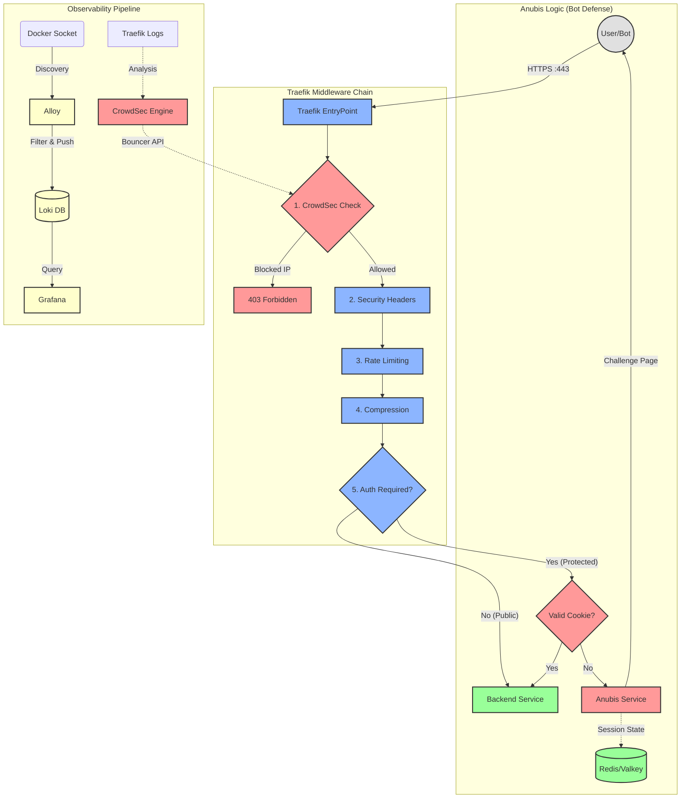

# Ironclad Anti-DDoS & Anti-Bot Stack

**Traefik + CrowdSec + Anubis + Grafana (LGT Stack)**

> **Automated, resource-efficient protection for multi-domain Docker environments and legacy web servers.**

---

## Table of Contents

- [Introduction](#introduction)
- [Architecture](#architecture)
- [Installation & Setup](#installation--setup)
- [Domain Management](#domain-management)
- [Operations Manual](#operations-manual)
- [Configuration Reference](#configuration-reference)
- [Components (Technical Details)](#components)
- [Project Structure](#project-structure)
- [Apache Legacy Configuration](#apache-legacy-configuration)
- [Trusted Local SSL (mkcert)](#trusted-local-ssl-mkcert)
- [Troubleshooting](#troubleshooting)
- [License](#license)

---

## Introduction

High-traffic environments require robust defense mechanisms that do not compromise performance. This project provides a production-ready infrastructure stack designed to protect hundreds of domains running on a single Docker host or hybrid environments.

### Key Benefits

- **🛡️ Multi-Layered Defense**: Combines IP reputation (CrowdSec), Layer 7 protection (Anubis PoW), and strict rate limiting.
- **⚡ Performance First**: Optimized middleware chain designed for zero latency overhead.
- **🤖 Fully Automated**: Configuration is dynamically generated from containers and a simple CSV file.
- **📊 Complete Visibility**: Full observability stack with Grafana, Loki, and real-time log viewing.
- **🏠 Hybrid Ready**: Protect Docker containers and legacy host-based services (like Apache/PHP) simultaneously.
- **🔐 No-Hassle SSL**: Automated Let's Encrypt certificates or locally trusted certs for development.

The system is managed via the **Domain Manager** UI or directly in `domains.csv`, making it accessible for both technical admins and less experienced users.

---

## Architecture

The stack operates on a "Defense in Depth" principle, filtering traffic through a precise middleware chain (The "Golden Chain") before it ever reaches the backend application.



---

---

## Installation & Setup

### 1. Prerequisites

- **Docker Engine** & **Docker Compose** (v2.x+)
- **Python 3** with required modules:
  ```bash
  # Debian/Ubuntu
  sudo apt install python3-yaml python3-tldextract
  
  # macOS
  pip3 install pyyaml tldextract
  ```
- Ports `80` and `443` free on the host machine.

### 2. Interactive Initialization

The easiest way to start is using the built-in setup wizard. It will guide you through all necessary settings (credentials, domains, alerts).

```bash
chmod +x initialize-env.sh
./initialize-env.sh
```

> [!NOTE]
> **Auto-Initialization**: If you run `./start.sh` without a `.env` file, the system will automatically launch this wizard for you.

### 3. Smart Credentials & Auto-Sync

The stack manages security hashes for you. You don't need to manually generate `htpasswd` strings.

1. **Manual Edit**: You can change any `_ADMIN_USER` or `_ADMIN_PASSWORD` directly in the `.env` file.
2. **Auto-Detection**: When you run `./start.sh`, the script detects the change.
3. **Instant Sync**: It regenerates the secure hashes and updates your `.env` and running containers immediately.

---

## Domain Management

This is where you define which websites the stack will protect and how they should behave.

### The Domain Inventory (`domains.csv`)

The heart of the configuration is the `domains.csv` file. You can manage it manually or via the **Domain Manager** UI.

| Column | Description | Mandatory |
|:---|:---|:---:|
| **domain** | The full domain (e.g., `shop.example.com`). | Yes |
| **redirection** | Target URL if you want to redirect (e.g., `another-site.com`). | No |
| **service** | Docker service name or `apache-host` for legacy servers. | Yes |
| **anubis_sub** | Subdomain for the bot protection portal (e.g., `auth`). | No |
| **rate_limit** | Max requests/sec for this specific domain. | No |
| **burst** | Max peak requests for this specific domain. | No |
| **concurrency** | Max active connections for this specific domain. | No |

### Domain Manager UI

Access the management interface at `https://domains.<your-domain>`.

- **Live Preview**: See which Docker containers are currently running and selectable.
- **Visual Grouping**: Domains are automatically grouped by their root (TLD) for easier management.
- **Safety Defaults**: The UI enforces safe defaults to prevent accidental misconfiguration.

---

## Operations Manual

### Common Commands

| Action | Command |
|---------|-------------|
| **Start/Update Stack** | `./start.sh` |
| **Stop Stack** | `./stop.sh` |
| **View Live Logs** | `https://dozzle.<your-domain>` |
| **Monitor Performance** | `docker compose -f docker-compose-tools.yaml run --rm ctop` |

### Security First Boot Sequence

When you run `./start.sh`, the stack follows a strict "Defense First" order:

1. **Environment Sync**: Validates your `.env` and ensures no critical settings are missing.
2. **Security Layer**: Boots **CrowdSec** and **Redis** first.
3. **Health Check**: Traefik **will not start** until CrowdSec is fully healthy and ready to filter traffic.
4. **Bouncer Sync**: Automatically registers the security keys between Traefik and CrowdSec.
5. **Application Layer**: Finally, boots your apps and the routing engine.

---

---

## Project Structure

```
.
├── .env.dist                              # Environment template
├── domains.csv.dist                       # Domain inventory template
├── generate-config.py                     # Configuration generator
├── initialize-env.sh                      # Interactive setup wizard
├── start.sh                               # Deployment script
├── stop.sh                                # Shutdown script
│
├── config/
│   ├── alloy/                             # Alloy log collector config
│   │   └── config.alloy
│   ├── anubis/                            # Anubis bot defense
│   │   └── assets/                        # Static assets (images, CSS)
│   ├── crowdsec/                          # CrowdSec IPS
│   │   ├── acquis.yaml
│   │   ├── profiles.yaml
│   │   └── parsers/                       # Custom parsers (IP whitelist)
│   ├── domain-manager/                     # Admin UI backend (Python/Flask)
│   │   ├── app.py
│   │   ├── static/
│   │   └── templates/
│   ├── grafana/                           # Grafana datasources
│   │   └── config.yaml
│   ├── loki/                              # Loki log storage
│   │   └── config.yaml
│   ├── redis/                             # Redis/Valkey session store
│   │   └── redis.conf
│   ├── watchdog/                          # Monitoring scripts
│   │   ├── Dockerfile
│   │   ├── check-certs.sh
│   │   ├── check-crowdsec.sh
│   │   └── check-dns.sh
│   └── traefik/                           # Traefik configuration
│       ├── traefik.yaml.template           # Static config template
│       └── dynamic-config/                # Generated routers/middlewares
│
└── Docker Compose Files:
    ├── docker-compose-traefik-crowdsec-redis.yaml   # Core infrastructure
    ├── docker-compose-tools.yaml                     # Tools & monitoring (Dozzle, watchdog, etc)
    ├── docker-compose-grafana-loki-alloy.yaml        # Observability stack
    ├── docker-compose-domain-manager.yaml            # Admin UI service
    ├── docker-compose-anubis-base.yaml               # Anubis template
    └── docker-compose-anubis-generated.yaml          # Auto-generated Anubis instances
```

---

## Components (Technical Details)

### Traefik (Edge Router)

Traefik serves as the ingress controller and the first line of defense.

- **SSL Termination**: Automatically handles Let's Encrypt certificates (staging or production).
- **Bouncer Integration**: Uses the CrowdSec Traefik Bouncer plugin to enforce IP bans at the edge.
- **Dynamic Configuration**: Reloads rules on-the-fly without downtime.

### The Golden Chain (Middleware Pipeline)

Every request entering the stack passes through a sequential chain of middlewares designed to filter, protect, and optimize traffic before it reaches your applications.

| Order | Middleware | Purpose | Security Benefit |
|:---:|:---|:---|:---|
| 1 | **CrowdSec Check** | Consults the local CrowdSec database for the client IP. | **Instant Mitigation**: Blocks known malicious IPs (botnets, scanners) at the entry point. |
| 2 | **Global Buffering** | Reads the entire request into memory before passing it to the backend. | **Slowloris Defense**: Prevents attackers from exhausting server sockets by sending data very slowly. Prioritized to protect resources ASAP. |
| 3 | **Security Headers** | Injects recommended browser security headers (HSTS, XSS, Frame-Options). | **Client Hardening**: Protects users from clickjacking and protocol downgrade attacks. |
| 4 | **Rate Limiting** | Throttles requests based on average and burst thresholds (global or per-domain). | **Flood Protection**: Mitigates automated scraping and brute-force attempts. |
| 5 | **Concurrency** | Limits the number of simultaneous active connections per client. | **Resource Preservation**: Ensures one heavy/malicious user cannot consume all backend worker threads. |
| 6 | **ForwardAuth (Anubis)** | (Optional) Intercepts requests to protected routes to verify or challenge the session. | **Bot Defense**: Forces suspicious or unauthenticated traffic to solve a Proof-of-Work challenge. |
| 7 | **Compression** | Dynamically compresses response bodies (Gzip) for supported clients. | **Performance**: Reduces bandwidth usage and improves load times for end-users. |

#### Specialized Middlewares

- **`apache-forward-headers`**: Injects `X-Forwarded-Proto: https` headers. Critical for legacy apps like WordPress to detect they are behind an SSL proxy.
- **`redirect-regex`**: Handles 301/302 redirections defined in `domains.csv` with optimized regex matching.
- **`anubis-assets-stripper`**: Internal helper to clean request paths for Anubis static assets, ensuring the backend receives clean URIs.

### CrowdSec (IPS)

CrowdSec is a collaborative Intrusion Prevention System that analyzes behavior to detect attacks (brute force, scanning, bot spam).

- **Log Analysis**: Reads logs via the Docker socket, matching patterns against community scenarios.
- **Community Blocklist**: Automatically shares and receives ban lists from the global network.
- **Remediation**: Instructs Traefik to ban IPs (403 Forbidden) via the bouncer API.

#### Architecture

```
┌─────────────────────────────────────────────────────────────┐
│                      CrowdSec Engine                        │
├─────────────────────────────────────────────────────────────┤
│  Parsers          │  Scenarios         │  LAPI (REST API)   │
│  ├─ traefik       │  ├─ http-probing   │  ├─ Decisions DB   │
│  ├─ nginx         │  ├─ http-crawlers  │  ├─ Bouncer API    │
│  └─ syslog        │  └─ brute-force    │  └─ Central API    │
└─────────────────────────────────────────────────────────────┘
         ▲                    │                    │
         │ Logs               │ Alerts             ▼
    ┌────┴────┐          ┌────┴────┐       ┌──────────────┐
    │ Traefik │          │ Console │       │   Bouncer    │
    │  Logs   │          │ CrowdSec│       │  (Traefik)   │
    └─────────┘          └─────────┘       └──────────────┘
```

#### Key Concepts

| Concept | Description |
|---------|-------------|
| **Parser** | Extracts structured data from logs (IP, user-agent, status codes) |
| **Scenario** | Defines malicious behavior patterns (e.g., 10 failed logins in 1 minute) |
| **Decision** | The remediation action (ban, captcha, throttle) with duration |
| **Bouncer** | Component that enforces decisions (Traefik plugin in our case) |
| **LAPI** | Local API that stores decisions and communicates with bouncers |
| **CAPI** | Central API for sharing threat intelligence with the community |

#### Installed Collections

This stack comes pre-configured with the following CrowdSec collections:

| Collection | Description |
|------------|-------------|
| `crowdsecurity/traefik` | Parsers and scenarios for Traefik access logs |
| `crowdsecurity/http-cve` | Detection of CVE exploits in HTTP requests |
| `crowdsecurity/sshd` | SSH brute-force detection |
| `crowdsecurity/whitelist-good-actors` | Whitelists known good bots (Google, Bing, etc.) |
| `crowdsecurity/base-http-scenarios` | Common HTTP attack patterns (path traversal, SQL injection) |
| `crowdsecurity/http-dos` | HTTP flood and DDoS detection |

#### Aggressive Ban Policy

Custom profiles in `config/crowdsec/profiles.yaml` enforce longer ban durations:

| Profile | Trigger | Ban Duration |
|---------|---------|--------------|
| Repeat Offender | IP triggers >5 events | **7 days** |
| Standard Attack | Any IP-based alert | **24 hours** (default is 4h) |
| Range Attack | Subnet-based alert | **48 hours** |

> [!TIP]
> You can customize ban durations by editing `config/crowdsec/profiles.yaml`.

#### CrowdSec Console (Optional)

You can enroll your instance in the [CrowdSec Console](https://app.crowdsec.net) to gain:
- Centralized view of alerts across multiple servers
- Access to premium blocklists
- Visual dashboards of attack trends

To enable it, provide your enrollment key during setup (`config/crowdsec/console-enrollment-key` is not used, use the interactive script or `.env`).

### Anubis (Bot Defense)

Anubis is a specialized "ForwardAuth" middleware for mitigating bots.

- **Mechanism**: When a user accesses a protected route without a valid session, Anubis intercepts the request.
- **Challenge**: Presents a cryptographic Proof-of-Work (PoW) challenge the client must solve.
- **Isolation**: One Anubis instance is deployed per TLD to respect "Same-Site" cookie policies.

#### Custom Assets

Anubis supports custom styling and images. The project includes default assets (with `.dist` extension) that are automatically used if you don't provide custom versions.

**Asset files:**

| File | Location | Description |
|------|----------|-------------|
| `custom.css` | `config/anubis/assets/` | Custom stylesheet for the challenge page |
| `happy.webp` | `config/anubis/assets/static/img/` | Image shown on successful challenge |
| `pensive.webp` | `config/anubis/assets/static/img/` | Image shown while solving challenge |
| `reject.webp` | `config/anubis/assets/static/img/` | Image shown on failed challenge |

**How it works:**

1. Default assets are stored with `.dist` extension (e.g., `custom.css.dist`)
2. When `start.sh` runs, it checks for each asset file
3. If a custom version exists (without `.dist`), it uses your custom file
4. If no custom version exists, it copies the default `.dist` file

**To customize:**

```bash
# Example: Create custom CSS
cp config/anubis/assets/custom.css.dist config/anubis/assets/custom.css
# Edit config/anubis/assets/custom.css with your changes

# Example: Use custom images
cp /path/to/your/happy.webp config/anubis/assets/static/img/happy.webp
```

> [!TIP]
> Your custom assets are git-ignored, so they won't be overwritten by project updates.

### Redis (State Management)

A high-performance Valkey (Redis-compatible) instance acts as the session store for Anubis.

- **Configuration**: Tuned for cache usage (`allkeys-lru`).
- **Persistence**: Uses AOF with per-second synchronization.

### Domain Manager (Admin UI)

The Domain Manager provides a user-friendly web interface (`https://domains.<domain>`) to manage the `domains.csv` inventory.

- **Real-time Updates**: Changes are applied immediately to the infrastructure.
- **Root Domain Grouping**: Automatically identifies and color-codes services by their root domain for better organization.
- **Strict Service Selection**: Dropdown automatically lists running Docker containers and detects `apache-host` availability (if Apache logs are present).
- **Security Defaults**: Enforces safe defaults for rate-limiting and Anubis protection.
- **Resource Discovery**: Lists currently running Docker containers to simplify service assignment.

### Observability Stack (Alloy, Loki, Grafana)

- **Alloy**: OpenTelemetry-compatible agent that discovers Docker containers and forwards logs to Loki.
- **Loki**: Log aggregation system optimized for efficiency.
- **Grafana**: Visual dashboards for traffic analysis and attack monitoring.

### Watchdog (Monitoring)

A lightweight utility service that monitors the stack and sends Telegram alerts.

| Script | Interval | Function |
|--------|----------|----------|
| `check-certs.sh` | 24 hours | Scans `acme.json` for certificates close to expiration |
| `check-dns.sh` | 6 hours (configurable) | Verifies all domains point to the correct IP |
| `check-crowdsec.sh` | 1 hour (configurable) | Monitors CrowdSec health, LAPI status, and bouncer connectivity |

### Auxiliary Tools

- **Dozzle**: Real-time log viewer for all containers (`https://dozzle.<domain>`).
- **ctop**: Interactive container monitoring (run manually with `docker compose -f docker-compose-tools.yaml run --rm ctop`).
- **Anubis-Assets**: Nginx server for local Anubis static assets.

---

## Project Structure

```
.
├── .env.dist                              # Environment template
├── domains.csv.dist                       # Domain inventory template
├── generate-config.py                     # Configuration generator
├── initialize-env.sh                      # Interactive setup wizard
├── start.sh                               # Deployment script
├── stop.sh                                # Shutdown script
│
├── config/
│   ├── alloy/                             # Alloy log collector config
│   │   └── config.alloy
│   ├── anubis/                            # Anubis bot defense
│   │   └── assets/                        # Static assets (images, CSS)
│   ├── crowdsec/                          # CrowdSec IPS
│   │   ├── acquis.yaml
│   │   ├── profiles.yaml
│   │   └── parsers/                       # Custom parsers (IP whitelist)
│   ├── domain-manager/                     # Admin UI backend (Python/Flask)
│   │   ├── app.py
│   │   ├── static/
│   │   └── templates/
│   ├── grafana/                           # Grafana datasources
│   │   └── config.yaml
│   ├── loki/                              # Loki log storage
│   │   └── config.yaml
│   ├── redis/                             # Redis/Valkey session store
│   │   └── redis.conf
│   ├── watchdog/                          # Monitoring scripts
│   │   ├── Dockerfile
│   │   ├── check-certs.sh
│   │   ├── check-crowdsec.sh
│   │   └── check-dns.sh
│   └── traefik/                           # Traefik configuration
│       ├── traefik.yaml.template           # Static config template
│       └── dynamic-config/                # Generated routers/middlewares
│
└── Docker Compose Files:
    ├── docker-compose-traefik-crowdsec-redis.yaml   # Core infrastructure
    ├── docker-compose-tools.yaml                     # Tools & monitoring (Dozzle, watchdog, etc)
    ├── docker-compose-grafana-loki-alloy.yaml        # Observability stack
    ├── docker-compose-domain-manager.yaml            # Admin UI service
    ├── docker-compose-anubis-base.yaml               # Anubis template
    └── docker-compose-anubis-generated.yaml          # Auto-generated Anubis instances
```

---

---

## Configuration Reference

### Environment Variables (`.env`)

#### General

| Variable | Description | Default |
|----------|-------------|---------|
| `DOMAIN` | Your primary/base domain (required for dashboards). | - |
| `PROJECT_NAME` | Prefix for all Docker containers. Prevents conflicts with other projects. | `stack` |
| `TZ` | Server timezone for logs and scheduled tasks. | `Europe/Madrid` |

#### Anubis (Bot Defense)

| Variable | Description | Default |
|----------|-------------|---------|
| `ANUBIS_DIFFICULTY` | Complexity of the Proof-of-Work challenge (1-5). Higher = more CPU for clients. | `4` |
| `ANUBIS_REDIS_PRIVATE_KEY` | Hex key for session signing. | *Auto-generated* |
| `ANUBIS_CPU_LIMIT` | Host CPU limit per Anubis instance (to prevent resource exhaustion). | `0.10` |
| `ANUBIS_MEM_LIMIT` | RAM limit per Anubis instance. | `32M` |

#### Redis & Security Layer

| Variable | Description | Default |
|----------|-------------|---------|
| `REDIS_PASSWORD` | Password for the session store. | *Auto-generated* |
| `CROWDSEC_DISABLE` | Set to `true` to completely disable the IPS (firewall). | `false` |
| `CROWDSEC_API_KEY` | Secure key for the Traefik-CrowdSec communication. | *Auto-generated* |
| `CROWDSEC_WHITELIST_IPS` | Comma-separated IPs/CIDRs that bypass all security checks. | - |
| `CROWDSEC_UPDATE_INTERVAL` | How often (seconds) to download the global blacklist. | `60` |
| `CROWDSEC_COLLECTIONS` | List of security scenarios to load (Traefik, SSH, DDoS, etc.). | *Defaults included* |
| `CROWDSEC_ENROLLMENT_KEY` | Optional key to connect to the [CrowdSec Console](https://app.crowdsec.net). | - |

#### Traefik (Edge Routing)

| Variable | Description | Default |
|----------|-------------|---------|
| `TRAEFIK_LISTEN_IP` | Host IP to bind ports 80/443. Use `0.0.0.0` for all interfaces. | `0.0.0.0` |
| `TRAEFIK_ACME_EMAIL` | Email for Let's Encrypt certificate notices (required for SSL). | - |
| `TRAEFIK_ACME_ENV_TYPE` | `production`, `staging` (testing), or `local` (mkcert). | `staging` |
| `TRAEFIK_GLOBAL_RATE_AVG` | Default requests per second allowed per IP. | `60` |
| `TRAEFIK_GLOBAL_RATE_BURST` | Peak requests allowed before blocking. | `120` |
| `TRAEFIK_GLOBAL_CONCURRENCY` | Max simultaneous connections per IP. | `25` |
| `TRAEFIK_HSTS_MAX_AGE` | HSTS header duration (seconds). | `31536000` |
| `TRAEFIK_BLOCKED_PATHS` | Comma-separated list of paths to block globally (e.g., `/wp-admin`). | - |
| `TRAEFIK_FRAME_ANCESTORS` | External domains allowed to embed your sites in iframes. | - |

#### Traefik Timeouts

Legacy applications or slow backends (e.g., heavy PHP/WordPress) may require adjusted timeouts. We provide two variables to control the entire pipeline (**Client** ↔ **Traefik** ↔ **Backend**).

| Variable | Default | Function |
|----------|---------|----------|
| `TRAEFIK_TIMEOUT_ACTIVE` | `60` | **Execution Limit** (Seconds). Max time allowed for the request to complete or headers to be received. |
| `TRAEFIK_TIMEOUT_IDLE` | `90` | **Connection Buffer** (Seconds). Max time to keep persistent connections open. |

#### Administrative Access

The stack uses independent credentials for each dashboard. These are synchronized automatically by `start.sh`.

| Variable | Service | Default |
|----------|---------|---------|
| `TRAEFIK_ADMIN_USER` | Traefik Dashboard | `admin` |
| `TRAEFIK_ADMIN_PASSWORD` | Traefik Dashboard | - |
| `DOMAIN_MANAGER_ADMIN_USER` | Domain Manager UI | `admin` |
| `DOMAIN_MANAGER_ADMIN_PASSWORD` | Domain Manager UI | - |
| `DOZZLE_ADMIN_USER` | Dozzle Log Viewer | `admin` |
| `DOZZLE_ADMIN_PASSWORD` | Dozzle Log Viewer | - |
| `GRAFANA_ADMIN_USER` | Grafana Dashboards | `admin` |
| `GRAFANA_ADMIN_PASSWORD` | Grafana Dashboards | - |

> [!NOTE]
> **Internal Variables**: Variables like `TRAEFIK_DASHBOARD_AUTH`, `DOZZLE_DASHBOARD_AUTH`, `DOMAIN_MANAGER_SECRET_KEY`, and `DOMAIN_MANAGER_APP_PATH_HOST` are managed automatically. You don't need to edit them manually.

#### Traefik Timeouts

Legacy applications or slow backends may require adjusted timeouts. We provide two variables to control the entire pipeline (**Client** ↔ **Traefik** ↔ **Backend**).

| Variable | Default | Function |
|----------|---------|----------|
| `TRAEFIK_TIMEOUT_ACTIVE` | `60` | **Active Connection Limit** (Seconds).<br>Controls `readTimeout`, `writeTimeout` (EntryPoints) and `responseHeaderTimeout` (Transport).<br><br>• **readTimeout**: Max time to read the entire request (headers + body) from the client.<br>• **writeTimeout**: Max time to write the response to the client. This is the effective "Time To First Byte" limit for your apps.<br>• **responseHeaderTimeout**: Max time Traefik waits for the backend to send response headers. |
| `TRAEFIK_TIMEOUT_IDLE` | `90` | **Idle Connection Buffer** (Seconds).<br>Controls `idleTimeout` (EntryPoints) and `idleConnTimeout` (Transport).<br><br>It is recommended to keep this value **higher** than the active timeout to avoid race conditions where a connection is closed just as a new request arrives.<br><br>• **idleTimeout**: Max time to keep an inactive connection open (Keep-Alive) waiting for a new request.<br>• **idleConnTimeout**: Max time an idle connection to the backend is kept open for reuse. |

> [!IMPORTANT]
> **Synchronization**: These variables update the configuration at **both ends** of the proxy.
> If your application takes 70 seconds to respond, you must increase **`TRAEFIK_TIMEOUT_ACTIVE`** to at least 75s. Setting only one side (e.g., Transport) would be useless if the other side (EntryPoint) cuts the connection at 60s.

#### Authentication

| Variable | Description | Default |
|----------|-------------|---------|
| `TRAEFIK_ADMIN_USER` | Traefik dashboard username | `admin` |
| `TRAEFIK_ADMIN_PASSWORD` | Traefik dashboard password | - |
| `DOMAIN_MANAGER_ADMIN_USER` | Domain Manager username | `admin` |
| `DOMAIN_MANAGER_ADMIN_PASSWORD` | Domain Manager password | - |
| `DOMAIN_MANAGER_SECRET_KEY` | Flask secret key for sessions | Auto-generated |
| `DOZZLE_ADMIN_USER` | Dozzle admin username | `admin` |
| `DOZZLE_ADMIN_PASSWORD` | Dozzle admin password | - |
| `GRAFANA_ADMIN_USER` | Grafana admin username | `admin` |
| `GRAFANA_ADMIN_PASSWORD` | Grafana admin password | - |

#### Stack-Watchdog Alerts

| Variable | Description | Default |
|----------|-------------|---------|
| `WATCHDOG_TELEGRAM_BOT_TOKEN` | Bot token from @BotFather | - |
| `WATCHDOG_TELEGRAM_RECIPIENT_ID` | Chat/group ID for alerts | - |
| `WATCHDOG_CERT_DAYS_WARNING` | Certificate expiration threshold (days) | `10` |
| `WATCHDOG_DNS_CHECK_INTERVAL` | DNS verification interval (seconds) | `21600` (6h) |
| `WATCHDOG_CROWDSEC_CHECK_INTERVAL` | CrowdSec check interval (seconds) | `3600` (1h) |

---

## Operations Manual

### Service Management

| Command | Description |
|---------|-------------|
| `./start.sh` | Deploy/update the stack |
| `./stop.sh` | Stop all containers |
| `docker compose -f docker-compose-tools.yaml run --rm ctop` | Interactive container monitor |

### Security Operations (CrowdSec)

All CrowdSec commands use `cscli` (CrowdSec CLI) inside the container:

```bash
docker exec crowdsec cscli <command>
```

#### Decision Management (Bans)

**Ban an IP:**
```bash
docker exec crowdsec cscli decisions add --ip <IP> --duration 24h --reason "Manual Ban"
```

**Ban an IP range (CIDR):**
```bash
docker exec crowdsec cscli decisions add --range 192.168.1.0/24 --duration 24h --reason "Subnet ban"
```

**Unban an IP:**
```bash
docker exec crowdsec cscli decisions delete --ip <IP>
```

**List active bans:**
```bash
docker exec crowdsec cscli decisions list
```

**List bans with details (JSON):**
```bash
docker exec crowdsec cscli decisions list -o json
```

#### Metrics & Statistics

**View real-time metrics:**
```bash
docker exec crowdsec cscli metrics
```

This shows:
- Parsed log lines per source
- Active scenarios and their triggers
- Bouncer API requests
- Decision counts (bans, captchas)

**View metrics in Prometheus format:**
```bash
docker exec crowdsec cscli metrics -o json
```

#### Alerts & Attack History

**List recent alerts:**
```bash
docker exec crowdsec cscli alerts list
```

**View detailed alert information:**
```bash
docker exec crowdsec cscli alerts inspect <ALERT_ID>
```

**Show alerts from the last hour:**
```bash
docker exec crowdsec cscli alerts list --since 1h
```

#### Scenario & Parser Management

**List installed scenarios:**
```bash
docker exec crowdsec cscli scenarios list
```

**List installed parsers:**
```bash
docker exec crowdsec cscli parsers list
```

**List installed collections:**
```bash
docker exec crowdsec cscli collections list
```

#### Hub Management (Install/Update Components)

**Update the hub index:**
```bash
docker exec crowdsec cscli hub update
```

**Upgrade all installed components:**
```bash
docker exec crowdsec cscli hub upgrade
```

**Install a new collection (e.g., for WordPress):**
```bash
docker exec crowdsec cscli collections install crowdsecurity/wordpress
```

**Search for available scenarios:**
```bash
docker exec crowdsec cscli hub list -a | grep <keyword>
```

#### Bouncer Management

**Check bouncer status:**
```bash
docker exec crowdsec cscli bouncers list
```

**Delete a bouncer:**
```bash
docker exec crowdsec cscli bouncers delete <bouncer_name>
```

**Add a new bouncer with specific key:**
```bash
docker exec crowdsec cscli bouncers add <name> --key <API_KEY>
```

#### Diagnostic Commands

**Check CrowdSec health:**
```bash
docker exec crowdsec cscli lapi status
```

**Validate configuration:**
```bash
docker exec crowdsec cscli config show
```

**Test log parsing (dry-run):**
```bash
docker exec crowdsec cscli explain --file /var/log/traefik/access.log --type traefik
```

> [!TIP]
> Use `docker exec crowdsec cscli <command> --help` for detailed options on any command.

### Monitoring Dashboards

| Dashboard | URL | Auth |
|-----------|-----|------|
| Traefik | `https://traefik.<domain>` | Basic Auth |
| Domain Manager | `https://domains.<domain>` | Login form |
| Grafana | `https://grafana.<domain>` | Login form |
| Dozzle | `https://dozzle.<domain>` | Basic Auth |

### Watchdog Alerts

The watchdog sends Telegram notifications for:

- ⚠️ **SSL Alerts**: Certificate expiring within threshold.
- 🌐 **DNS Alerts**: Domain not resolving to the expected host IP.
- 🛡️ **CrowdSec Alerts**: LAPI down, no bouncers, or bouncer connection issues.

---
 
 ## Trusted Local SSL (mkcert)
 
 This stack supports locally trusted certificates to prevent browser security warnings ("Your connection is not private") during development.
 
 ### Prerequisites
 
 1. Install [mkcert](https://github.com/FiloSottile/mkcert) on your host machine.
 2. Run `mkcert -install` to add the local CA to your system's trust store.
 
 ### Setup Instructions
 
 1.  **Configure Environment**:
     Set `TRAEFIK_ACME_ENV_TYPE=local` in your `.env` file.
 
   2.  **Generate Certificates**:
       The stack is designed to be plug-and-play. When you run `./start.sh` with `TRAEFIK_ACME_ENV_TYPE=local`, the system will:
       - Automatically scan your `/etc/hosts` for any domains pointing to `127.0.0.1`.
       - Filter out defaults like `localhost` and `broadcasthost`.
       - Invoke `mkcert` to generate a single certificate covering all discovered domains.
       - Store the results in `config/traefik/certs-local-dev/`.
       - Dynamically configure Traefik to use these certificates as the default for all HTTPS traffic.

       > [!TIP]
       > **Manual execution**: If you add new entries to `/etc/hosts` and want to refresh the certificate without a full restart, you can run `./create-local-certs.sh` manually at any time.

   3.  **Start the Stack**:
       ```bash
       ./start.sh
       ```
       You will see a message: `🔐 Local Mode detected. Automating certificate generation...` followed by the `mkcert` output and the confirmation that `local-certs.yaml` has been generated.
 ---
 
 ## Apache Legacy Configuration

This section covers the configuration required for legacy Apache installations running directly on the host (not in Docker containers). When using the `apache-host` service type in `domains.csv`, Traefik proxies requests to Apache on `host.docker.internal:8080`. Additional configuration is needed to ensure proper functionality.

### Real Client IP Forwarding

By default, Apache will log Docker's internal IP (e.g., `172.18.0.5`) instead of the real client IP because Traefik acts as a reverse proxy. To restore real client IPs in Apache logs and applications, configure the `mod_remoteip` module.

#### Step 1: Enable the RemoteIP Module

```bash
sudo a2enmod remoteip
```

#### Step 2: Create the RemoteIP Configuration

Create or edit `/etc/apache2/conf-available/remoteip.conf`:

```apache
# ==============================================
# RemoteIP Configuration for Traefik Proxy
# ==============================================

# Use X-Forwarded-For header to determine the real client IP
RemoteIPHeader X-Forwarded-For

# Trust requests from Docker networks
# These ranges cover typical Docker bridge networks
RemoteIPTrustedProxy 172.16.0.0/12
RemoteIPTrustedProxy 10.0.0.0/8
RemoteIPTrustedProxy 192.168.0.0/16

# Trust localhost (for local testing)
RemoteIPTrustedProxy 127.0.0.1
RemoteIPTrustedProxy ::1
```

#### Step 3: Enable the Configuration

```bash
sudo a2enconf remoteip
```

#### Step 4: Update Log Format (Recommended)

Edit `/etc/apache2/apache2.conf` and update the `LogFormat` directives to use `%a` (actual client IP after mod_remoteip processing) instead of `%h` (direct connection IP):

```apache
# Before (logs Docker proxy IP):
LogFormat "%h %l %u %t \"%r\" %>s %b \"%{Referer}i\" \"%{User-Agent}i\"" combined

# After (logs real client IP):
LogFormat "%a %l %u %t \"%r\" %>s %b \"%{Referer}i\" \"%{User-Agent}i\"" combined
```

> [!TIP]
> The `%a` format specifier automatically uses the IP from `X-Forwarded-For` when `mod_remoteip` is configured, falling back to the direct connection IP if the header is not present.

#### Step 5: Restart Apache

```bash
sudo systemctl restart apache2
```

#### Verification

Check that real IPs are now appearing in logs:

```bash
tail -f /var/log/apache2/*access*.log
```

You should see external client IPs instead of Docker internal IPs (172.x.x.x).

### Apache Log Aggregation (Optional)

To include Apache host logs in the Grafana/Loki observability pipeline, the stack provides an optional `docker-compose-apache-logs.yml` file. This is automatically included by `start.sh` when `/var/log/apache2` exists on the host.

#### How It Works

1. **Automatic Detection**: `start.sh` checks for `/var/log/apache2` directory
2. **Volume Mount**: If found, mounts the logs into:
    - **Alloy container**: For log processing and aggregation.
    - **Domain Manager container**: To verify Apache presence and enable the `apache-host` option in the UI.
3. **Log Parsing**: Alloy processes both access and error logs with proper label extraction

#### Parsed Labels

The following labels are automatically extracted and available in Grafana:

| Label | Description | Log Type |
|-------|-------------|----------|
| `job` | Always `apache-host` | Both |
| `log_type` | `access` or `error` | Both |
| `vhost` | Virtual host from filename | Both |
| `client_ip` | Client IP address | Both |
| `method` | HTTP method (GET, POST, etc.) | Access |
| `status` | HTTP status code | Access |
| `level` | Error level (error, warn, notice) | Error |
| `module` | Apache module (php, proxy_fcgi, etc.) | Error |

#### Querying Apache Logs in Grafana

Example LogQL queries for Apache host logs:

```logql
# All Apache host logs
{job="apache-host"}

# Only error logs
{job="apache-host", log_type="error"}

# Errors from a specific vhost
{job="apache-host", log_type="error", vhost="example.com"}

# 5xx errors from access logs
{job="apache-host", log_type="access", status=~"5.."}

# PHP errors
{job="apache-host", log_type="error", module="php"}
```

#### Manual Inclusion

If you need to manually control Apache log inclusion (instead of automatic detection), edit `start.sh` and modify the `COMPOSE_FILES` variable:

```bash
# Always include Apache logs
COMPOSE_FILES="$COMPOSE_FILES -f docker-compose-apache-logs.yml"

# Or remove the automatic detection block entirely
```

---

## Troubleshooting

### 502 Bad Gateway

- **Naming**: Verify the `service` name in `domains.csv` matches the container `container_name` or `service` key.
- **Network**: Ensure the backend container is on the `traefik` network (`external: true`).
- **Internal Ports**: If your service listens on a non-standard port (not 80), you must add individual Traefik labels for `loadbalancer.server.port`.

### 504 Gateway Timeout

- **Network Isolation**: This usually means Traefik cannot reach the backend. Ensure your backend container is connected to the `traefik` network.
    ```yaml
    networks:
      - traefik
    ```
- **Firewall/Internal**: Check if the container itself is running and healthy.

### Service "X" does not exist

- **Dynamic Config**: If using `generate-config.py`, this error means the service defined in `domains.csv` (column `service`) does not match any running Docker container or the auto-generated service name.
- **Tip**: Run `docker ps` to see the actual names of your containers.

### Credentials sync failed

- If your `.env` gets corrupted, delete the `_ADMIN_CREDS_SYNC` variables and the `_DASHBOARD_AUTH` hashes. Run `./start.sh` and the system will attempt to repair/regenerate them based on your `_USER` and `_PASSWORD` variables.

### Anubis Cookie Issues

- **Same-Site**: Chrome and modern browsers require HTTPS for `SameSite=None` cookies. Anubis handles this, but ensure you are accessing via HTTPS.
- **Root Domain Mismatch**: Ensure `DOMAINS.CSV` uses the correct `anubis_sub`. If you protect `a.com` but your auth subdomain is `auth.b.com`, the cookie will be rejected.

### Anubis Cookie Loops

- Ensure your browser accepts cookies.
- Verify DNS for auth subdomain points to the server.
- Check Anubis logs: `docker logs anubis-<tld>`.

### Certificate Not Renewing

- Check Traefik logs: `docker logs traefik`.
- Verify ACME email is correct in `.env`.
- For testing, use `TRAEFIK_ACME_ENV_TYPE=staging` to avoid rate limits.

---

## License

This project is licensed under the **MIT License**.
