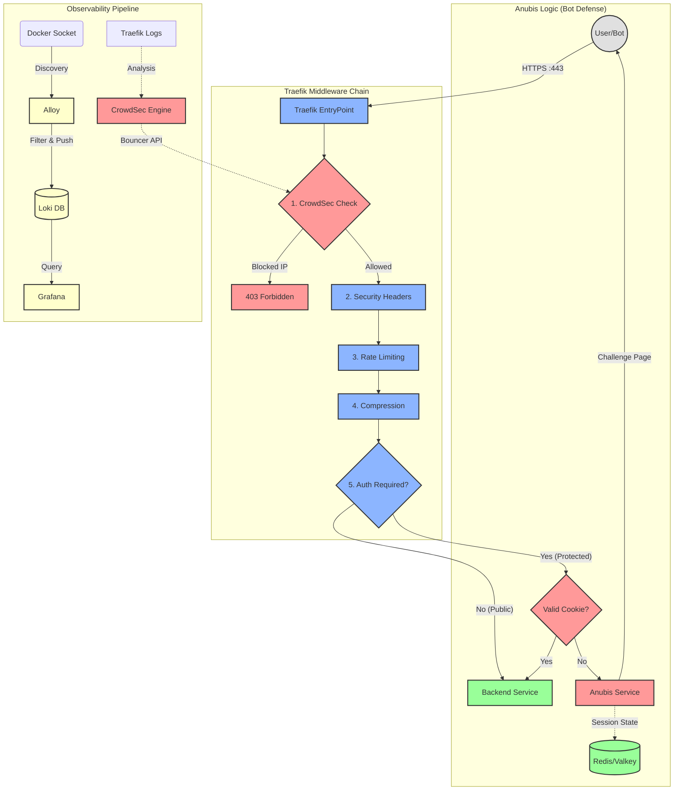

# Ironclad Anti-DDoS & Anti-Bot Stack

**Traefik + CrowdSec + Anubis + Grafana (LGT Stack)**

> **Automated, resource-efficient protection for multi-domain Docker environments and legacy web servers.**

---

## Table of Contents

- [Introduction](#introduction)
- [Architecture](#architecture)
- [Components](#components)
- [Project Structure](#project-structure)
- [Installation & Setup](#installation--setup)
- [Configuration Reference](#configuration-reference)
- [Operations Manual](#operations-manual)
- [Troubleshooting](#troubleshooting)
- [License](#license)

---

## Introduction

High-traffic environments require robust defense mechanisms that do not compromise performance. This project provides a production-ready infrastructure stack designed to protect hundreds of domains running on a single Docker host or hybrid environments.

It integrates industry-standard components to provide a multi-layered defense strategy:

1. **Traefik**: High-performance edge routing and SSL termination.
2. **CrowdSec**: Collaborative Intrusion Prevention System (IPS) leveraging global threat intelligence.
3. **Anubis**: Custom "ForwardAuth" middleware implementing Proof-of-Work (PoW) challenges to mitigate sophisticated bot attacks.
4. **Alloy & Loki**: Modern, resource-efficient log aggregation and processing pipeline.
5. **Grafana**: Centralized observability and analytics.

The system is fully automated. A Python orchestrator (`generate-config.py`) dynamically compiles complex Traefik configurations from a simple CSV inventory, ensuring consistent security policies across all services.

---

## Architecture

The stack operates on a "Defense in Depth" principle, filtering traffic through a precise middleware chain (The "Golden Chain") before it ever reaches the backend application.



---

## Components

### Traefik (Edge Router)

Traefik serves as the ingress controller and the first line of defense.

- **SSL Termination**: Automatically handles Let's Encrypt certificates (staging or production).
- **Bouncer Integration**: Uses the CrowdSec Traefik Bouncer plugin to enforce IP bans at the edge.
- **Dynamic Configuration**: Reloads rules on-the-fly without downtime.

### CrowdSec (IPS)

CrowdSec analyzes behavior to detect attacks (brute force, scanning, bot spam).

- **Log Analysis**: Reads logs via the Docker socket, matching patterns against community scenarios.
- **Community Blocklist**: Automatically shares and receives ban lists from the global network.
- **Remediation**: Instructs Traefik to ban IPs (403 Forbidden).

### Anubis (Bot Defense)

Anubis is a specialized "ForwardAuth" middleware for mitigating bots.

- **Mechanism**: When a user accesses a protected route without a valid session, Anubis intercepts the request.
- **Challenge**: Presents a cryptographic Proof-of-Work (PoW) challenge the client must solve.
- **Isolation**: One Anubis instance is deployed per TLD to respect "Same-Site" cookie policies.
- **Customization**: Modify assets in `config/anubis/assets/` (images: `pensive.webp`, `happy.webp`, `reject.webp`; styles: `custom.css`).

### Redis (State Management)

A high-performance Valkey (Redis-compatible) instance acts as the session store for Anubis.

- **Configuration**: Tuned for cache usage (`allkeys-lru`).
- **Persistence**: Uses AOF with per-second synchronization.

### Observability Stack (Alloy, Loki, Grafana)

- **Alloy**: OpenTelemetry-compatible agent that discovers Docker containers and forwards logs to Loki.
- **Loki**: Log aggregation system optimized for efficiency.
- **Grafana**: Visual dashboards for traffic analysis and attack monitoring.

### Stack-Watchdog (Monitoring)

A lightweight utility service that monitors the stack and sends Telegram alerts.

| Script | Interval | Function |
|--------|----------|----------|
| `check-certs.sh` | 24 hours | Scans `acme.json` for certificates close to expiration |
| `check-dns.sh` | 6 hours (configurable) | Verifies all domains point to the correct IP |
| `check-crowdsec.sh` | 1 hour (configurable) | Monitors CrowdSec health, LAPI status, and bouncer connectivity |

### Auxiliary Tools

- **Dozzle**: Real-time log viewer for all containers (`https://dozzle.<domain>`).
- **ctop**: Interactive container monitoring (run manually with `docker compose -f docker-compose-tools.yml run --rm ctop`).
- **Anubis-Assets**: Nginx server for local Anubis static assets.

---

## Project Structure

```
.
├── .env.dist                              # Environment template
├── domains.csv.dist                       # Domain inventory template
├── generate-config.py                     # Configuration generator
├── initialize-env.sh                      # Interactive setup wizard
├── start.sh                               # Deployment script
├── stop.sh                                # Shutdown script
│
├── config/
│   ├── alloy/                             # Alloy log collector config
│   │   └── config.alloy
│   ├── anubis/                            # Anubis bot defense
│   │   └── assets/                        # Static assets (images, CSS)
│   ├── crowdsec/                          # CrowdSec IPS
│   │   └── acquis.yaml
│   ├── grafana/                           # Grafana datasources
│   │   └── config.yaml
│   ├── loki/                              # Loki log storage
│   │   └── config.yaml
│   ├── redis/                             # Redis/Valkey session store
│   │   └── redis.conf
│   ├── stack-watchdog/                    # Monitoring scripts
│   │   ├── Dockerfile
│   │   ├── check-certs.sh
│   │   ├── check-crowdsec.sh
│   │   └── check-dns.sh
│   └── traefik/                           # Traefik configuration
│       ├── traefik.yml.template           # Static config template
│       └── dynamic-config/                # Generated routers/middlewares
│
└── Docker Compose Files:
    ├── docker-compose-traefik-crowdsec-redis.yml   # Core infrastructure
    ├── docker-compose-tools.yml                     # Tools & monitoring
    ├── docker-compose-grafana-loki-alloy.yml        # Observability stack
    ├── docker-compose-anubis-base.yml               # Anubis template
    └── docker-compose-anubis-generated.yml          # Auto-generated Anubis instances
```

---

## Installation & Setup

### 1. Prerequisites

- **Docker Engine** & **Docker Compose** (v2.x+)
- **Python 3** with required modules:
  ```bash
  # Debian/Ubuntu
  sudo apt install python3-yaml python3-tldextract
  
  # macOS
  pip3 install pyyaml tldextract
  ```
- Ports `80` and `443` free on the host machine.

### 2. Environment Initialization

Run the interactive setup wizard:

```bash
chmod +x initialize-env.sh
./initialize-env.sh
```

The wizard will prompt for:
- **Admin credentials**: Applied to Grafana (plaintext) and hashed (bcrypt) for Traefik/Dozzle dashboards.
- **Domain & Timezone**: Your primary domain and server timezone.
- **Telegram alerts** (optional): Bot token and chat ID for notifications.
- **ACME environment**: Staging (testing) or Production (real certificates).

### 3. Domain Configuration

Copy and edit the domain inventory:

```bash
cp domains.csv.dist domains.csv
```

**Columns:**

| Column | Description | Example |
|--------|-------------|---------|
| `domain` | Public FQDN | `app.example.com` |
| `redirection` | (Optional) 301 redirect target | `www.example.com` |
| `service` | Docker container name or `apache-host` | `wordpress` |
| `anubis_subdomain` | Subdomain for auth portal | `auth` → `auth.example.com` |
| `rate_limit` | Requests/second (average) | `50` |
| `burst` | Maximum burst size | `100` |
| `concurrency` | Max simultaneous connections | `20` |

### 4. Deployment

```bash
./start.sh
```

This script:
1. Generates `traefik-generated.yml` from template
2. Runs `generate-config.py` to create routes
3. Creates required networks
4. Boots CrowdSec/Redis first (security layer)
5. Waits for CrowdSec health check
6. Registers the bouncer API key
7. Deploys all remaining services

---

## Configuration Reference

### Environment Variables (`.env`)

#### General

| Variable | Description | Default |
|----------|-------------|---------|
| `DOMAIN` | Primary domain for admin dashboards | - |
| `TZ` | Server timezone | `Europe/Madrid` |

#### Anubis

| Variable | Description | Default |
|----------|-------------|---------|
| `ANUBIS_DIFFICULTY` | PoW challenge complexity (1-5) | `4` |
| `ANUBIS_REDIS_PRIVATE_KEY` | Key for session signing | Auto-generated |
| `ANUBIS_CPU_LIMIT` | CPU limit per instance | `0.10` |
| `ANUBIS_MEM_LIMIT` | Memory limit per instance | `32M` |

#### Redis

| Variable | Description | Default |
|----------|-------------|---------|
| `REDIS_PASSWORD` | Redis authentication password | Auto-generated |

#### CrowdSec

| Variable | Description | Default |
|----------|-------------|---------|
| `CROWDSEC_API_KEY` | Bouncer API key | Auto-generated |
| `CROWDSEC_UPDATE_INTERVAL` | Blocklist refresh interval (seconds) | `60` |

#### Traefik

| Variable | Description | Default |
|----------|-------------|---------|
| `TRAEFIK_LISTEN_IP` | IP to bind ports 80/443 | `0.0.0.0` |
| `GLOBAL_RATE_AVG` | Default rate limit (req/s) | `60` |
| `GLOBAL_RATE_BURST` | Default burst size | `120` |
| `GLOBAL_CONCURRENCY` | Default concurrent connections | `25` |
| `HSTS_MAX_AGE` | HSTS header duration (seconds) | `31536000` |
| `ACME_EMAIL` | Let's Encrypt contact email | - |
| `ACME_ENV_TYPE` | `staging` or `production` | `staging` |
| `TRAEFIK_DASHBOARD_AUTH` | Basic auth for dashboard (htpasswd format) | - |

#### Grafana

| Variable | Description | Default |
|----------|-------------|---------|
| `GF_ADMIN_USER` | Grafana admin username | - |
| `GF_ADMIN_PASSWORD` | Grafana admin password | - |

#### Stack-Watchdog Alerts

| Variable | Description | Default |
|----------|-------------|---------|
| `TELEGRAM_BOT_TOKEN` | Bot token from @BotFather | - |
| `TELEGRAM_RECIPIENT_ID` | Chat/group ID for alerts | - |
| `DAYS_WARNING` | Certificate expiration threshold (days) | `10` |
| `DNS_CHECK_INTERVAL` | DNS verification interval (seconds) | `21600` (6h) |
| `CROWDSEC_CHECK_INTERVAL` | CrowdSec check interval (seconds) | `3600` (1h) |

---

## Operations Manual

### Service Management

| Command | Description |
|---------|-------------|
| `./start.sh` | Deploy/update the stack |
| `./stop.sh` | Stop all containers |
| `docker compose -f docker-compose-tools.yml run --rm ctop` | Interactive container monitor |

### Security Operations (CrowdSec)

**Ban an IP:**
```bash
docker exec crowdsec cscli decisions add --ip <IP> --duration 24h --reason "Manual Ban"
```

**Unban an IP:**
```bash
docker exec crowdsec cscli decisions delete --ip <IP>
```

**List active bans:**
```bash
docker exec crowdsec cscli decisions list
```

**Check bouncer status:**
```bash
docker exec crowdsec cscli bouncers list
```

### Monitoring Dashboards

| Dashboard | URL | Auth |
|-----------|-----|------|
| Traefik | `https://traefik.<domain>` | Basic Auth |
| Grafana | `https://grafana.<domain>` | Login form |
| Dozzle | `https://dozzle.<domain>` | Basic Auth |

### Stack-Watchdog Alerts

The stack-watchdog sends Telegram notifications for:

- ⚠️ **SSL Alerts**: Certificate expiring within threshold
- 🌐 **DNS Alerts**: Domain not resolving to expected IP
- 🛡️ **CrowdSec Alerts**: LAPI down, no bouncers, or stale bouncer connections

---

## Troubleshooting

### 502 Bad Gateway

- Verify the `service` name in `domains.csv` matches the container name.
- Ensure the backend container is on the `traefik` network.
- Check container logs: `docker logs <container_name>`.

### CrowdSec Connection Refused

- Verify `CROWDSEC_API_KEY` matches the registered bouncer.
- Check bouncer status: `docker exec crowdsec cscli bouncers list`.
- Regenerate key if needed:
  ```bash
  docker exec crowdsec cscli bouncers delete traefik-bouncer
  docker exec crowdsec cscli bouncers add traefik-bouncer
  ```

### Anubis Cookie Loops

- Ensure your browser accepts cookies.
- Verify DNS for auth subdomain points to the server.
- Check Anubis logs: `docker logs anubis-<tld>`.

### Certificate Not Renewing

- Check Traefik logs: `docker logs traefik`.
- Verify ACME email is correct in `.env`.
- For testing, use `ACME_ENV_TYPE=staging` to avoid rate limits.

---

## License

This project is licensed under the **MIT License**.
