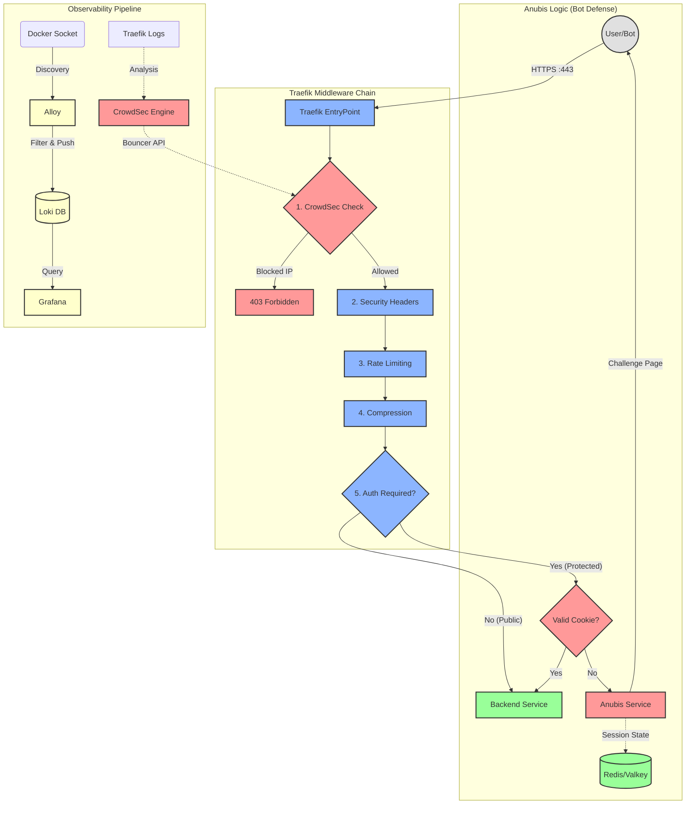

# Ironclad Anti-DDoS & Anti-Bot Stack

**Traefik + CrowdSec + Anubis + Grafana (LGT Stack)**

> **Automated, resource-efficient protection for multi-domain Docker environments and legacy web servers.**

## Introduction

High-traffic environments require robust defense mechanisms that do not compromise performance. This project provides a production-ready infrastructure stack designed to protect hundreds of domains running on a single Docker host or hybrid environments.

It integrates industry-standard components to provide a multi-layered defense strategy:
1.  **Traefik**: High-performance edge routing and SSL termination.
2.  **CrowdSec**: Collaborative Intrusion Prevention System (IPS) leveraging global threat intelligence.
3.  **Anubis**: Custom "ForwardAuth" middleware implementing Proof-of-Work (PoW) challenges to mitigate sophisticated bot attacks.
4.  **Alloy & Loki**: Modern, resource-efficient log aggregation and processing pipeline.
5.  **Grafana**: Centralized observability and analytics.

The system is fully automated. A Python orchestrator (`generate-config.py`) dynamically compiles complex Traefik configurations from a simple CSV inventory, ensuring consistent security policies across all services.

## Architecture

The stack operates on a "Defense in Depth" principle, filtering traffic through a precise middleware chain (The "Golden Chain") before it ever reaches the backend application.



## Component Deep Dive

### Traefik (Edge Router)
Traefik serves as the ingress controller and the first line of defense.
*   **SSL Termination**: Automatically handles Let's Encrypt certificates.
*   **Bouncer Integration**: Uses the CrowdSec Traefik Bouncer plugin to enforce IP bans at the edge, dropping malicious traffic before it consumes resources.
*   **Dynamic Configuration**: Reloads rules on-the-fly without downtime.

### CrowdSec (IPS)
CrowdSec analyzes behavior to detect attacks (brute force, scanning, bot spam).
*   **Log Analysis**: Readings logs via the Docker socket (or file volume), it matches patterns against community scenarios.
*   **Community Blocklist**: Automatically shares and receives ban lists from the global network, preemptively blocking known attackers.
*   **Remediation**: Instructs Traefik to ban IPs (403 Forbidden) or can be configured to send them to a Captcha portal.

### Anubis (Application Defense)
Anubis is a specialized "ForwardAuth" middleware for mitigating bots that bypass IP reputation checks.
*   **Mechanism**: When a user accesses a protected route without a valid session, Anubis intercepts the request.
*   **Challenge**: It presents a cryptographic Proof-of-Work (PoW) challenge that the client browser must solve using JavaScript. This is computationally expensive for bots but trivial for legitimate browsers.
*   **Isolation**: One Anubis instance is deployed per Top-Level Domain (TLD) to respect "Same-Site" cookie policies and isolate failure domains.
*   **Customization**: Anubis assets are served locally from `config-anubis/assets/`. You can customize the look and feel by modifying:
    *   **Images**: Replace `pensive.webp` (loading state), `happy.webp` (success state) and `reject.webp` (failure state) with your own images.
    *   **Styles**: Edit `custom.css` to change fonts, colors, and layout. No external dependencies are required.
### Cert Monitor (SSL Watchdog)
A lightweight utility service that ensures SSL reliability.
*   **Audit**: Daily scans of Traefik's `acme.json` certificate store.
*   **Alerting**: Sends a **Telegram** notification if any certificate is close to expiration (default 10 days) and has not been automatically renewed by Traefik.
*   **Zero-Config**: Uses the existing `acme.json` volume and requires only a Bot Token and Chat ID.

### Redis (State Management)
A high-performance Valkey (Redis compatible) instance acts as the session store for Anubis.
*   **Configuration**: Tuned for cache usage (`allkeys-lru`). If memory creates pressure, it acts as a cache, evicting the oldest sessions rather than crashing.
*   **Persistence**: Uses AOF (Append Only File) with per-second synchronization to balance performance and data safety.

### Observability Stack (Alloy, Loki, Grafana)
We utilize the modern Grafana LGT stack for comprehensive monitoring.
*   **Alloy**: The OpenTelemetry Collector compatible agent. It discovers Docker containers, processes logs (filtering noise, formatting JSON), and forwards them to Loki.
*   **Loki**: A log aggregation system optimized for efficiency, indexing only metadata (labels) rather than the full log text.
*   **Grafana**: Provides visual dashboards for traffic analysis, attack monitoring, and system resource usage.

## Installation & Setup

### 1. Prerequisites
*   **Docker Engine** & **Docker Compose**
*   **Python 3** (for the configuration generator)
    ```bash
    sudo apt install python3-yaml python3-tldextract
    ```
*   Ports `80` and `443` free on the host machine.

### 2. Environment Initialization
We provide an automated script to securely initialize the environment configuration.

1.  **Execute the script:**
    ```bash
    chmod +x initialize-env.sh
    ./initialize-env.sh
    ```
2.  **Follow the prompts:**
    *   **Administrative Credentials**: You will be asked for a username and password. These will be applied to **Grafana** (plaintext) and hashed securely (bcrypt) for the **Traefik** and **Dozzle** dashboards.
    *   **Domain & Timezone**: Set your primary domain and server timezone.
    *   **Key Generation**: The script automatically generates cryptographic keys for Anubis signatures and CrowdSec API communication.

### 3. Domain Configuration
The `domains.csv` file acts as the single source of truth for your infrastructure.

**File Location:** `domains.csv` (Copy from `domains.csv.dist`)

**Columns:**
| Column | Description | Example |
| :--- | :--- | :--- |
| `domain` | The public Fully Qualified Domain Name. | `app.example.com` |
| `redirection` | (Optional) Target URL.  The domain will 301 redirect to this URL. | `www.example.com` |
| `service` | Internal Docker container name OR `apache-host` (points to host:8080). | `wordpress` or `apache-host` |
| `anubis_subdomain` | Subdomain prefix for the auth portal (optional). | `auth` (creates `auth.example.com`) |
| `rate_limit` | Requests per second limit (average). | `50` |
| `burst` | Maximum burst size allowed. | `100` |
| `concurrency` | Maximum simultaneous connections. | `20` |

### 4. Deployment
Start the stack using the provided helper script, which handles the generation pipeline and Docker commands.
```bash
./start.sh
```

## Configuration Reference

### Environment Variables (`.env`)
Key variables that control the stack's behavior:

*   **ANUBIS**:
    *   `ANUBIS_DIFFICULTY`: (1-5) Complexity of the PoW challenge. Higher = harder for CPU.
    *   `ANUBIS_CPU_LIMIT`: Docker resource limit to prevents DoS via the auth service.
*   **TRAEFIK**:
    *   `GLOBAL_RATE_AVG`: Default rate limit for services not specified in CSV.
    *   `HSTS_MAX_AGE`: Duration for Strict-Transport-Security header (seconds).
*   **CROWDSEC**:
    *   `CROWDSEC_UPDATE_INTERVAL`: Frequency of blocklist updates.
*   **TELEGRAM ALERTS** (Optional):
    *   `TELEGRAM_BOT_TOKEN`: Bot Token from @BotFather.
    *   `TELEGRAM_RECIPIENT_ID`: Chat ID or Group ID to receive expiration alerts.

### Configuration Generator (`generate-config.py`)
This script runs automatically during startup. It:
1.  Parses `domains.csv`.
2.  Groups subdomains by Root Domain (TLD).
3.  Generates a specific `docker-compose-anubis-generated.yml` with one Anubis service per TLD.
4.  Generates `config-traefik/dynamic-config/routes.yml` defining Routers, Services, and Middleware chains.

## Operations Manual

### Service Management
*   **Start/Update**: `./start.sh` (Re-runs generation and applies changes).
*   **Stop**: `./stop.sh` (Stops containers and cleans up orphans).

### Security Operations (CrowdSec)
Interact with the CrowdSec engine via `cscli` inside the container.

**Ban an IP:**
```bash
docker exec crowdsec cscli decisions add --ip <IP_ADDRESS> --duration 24h --reason "Manual Ban"
```

**Unban an IP:**
```bash
docker exec crowdsec cscli decisions delete --ip <IP_ADDRESS>
```

**Inspect Active Bans:**
```bash
docker exec crowdsec cscli decisions list
```

### Monitoring
Access the following dashboards (credentials configured during initialization):
*   **Traefik Dashboard**: `https://traefik.<your-domain>` - Route health and middleware status.
*   **Grafana**: `https://grafana.<your-domain>` - Logs, metrics, and traffic visualization.
*   **Dozzle**: `https://dozzle.<your-domain>` - live container logs viewer.

## Troubleshooting

*   **502 Bad Gateway**: Usually indicates Traefik cannot reach the backend container. Verify the `docker_service` name in `domains.csv` matches the actual container name and that they share the `traefik` network.
*   **CrowdSec Connection Refused**: If the Bouncer cannot reach the LAPI, ensure the `CROWDSEC_API_KEY` in `.env` matches the one registered in CrowdSec (`docker exec crowdsec cscli bouncers list`). existence.
*   **Anubis Loops**: Ensure your browser accepts cookies. If using `auth` subdomain, verify DNS records point to the server.

## License

This project is licensed under the **MIT License**.
