# Ironclad Anti-DDoS & Anti-Bot Stack

### Traefik + CrowdSec + Anubis + Grafana (LGT Stack)

> **Automated, resource-efficient protection for multi-domain Docker environments or legacy web servers.**

```mermaid
graph TD
    %% Estilos
    classDef user fill:#f9f,stroke:#333,stroke-width:2px;
    classDef traefik fill:#8cb5ff,stroke:#333,stroke-width:2px;
    classDef security fill:#ff9999,stroke:#333,stroke-width:2px;
    classDef app fill:#99ff99,stroke:#333,stroke-width:2px;
    classDef observ fill:#ffffcc,stroke:#333,stroke-width:2px;

    User((👤 User/Bot)):::user -->|HTTPS :443| T_Entry[Traefik EntryPoint]:::traefik

    subgraph "🛡️ Traefik Middleware Chain (Golden Chain)"
        T_Entry --> MW_CS{1. CrowdSec OK?}:::security
        MW_CS -- NO (IP Ban) --> Block[⛔ 403 Forbidden]:::security
        MW_CS -- YES --> MW_Sec["2. Security Headers<br>HSTS/XSS"]:::traefik
        MW_Sec --> MW_RL["3. Rate Limit &<br>Concurrency"]:::traefik
        MW_RL --> MW_Comp["4. Compress (Gzip)"]:::traefik
        MW_Comp --> MW_Auth{5. Auth Required?}:::traefik
    end

    subgraph "🐶 Anubis Logic"
        MW_Auth -- NO (Public Web) --> Backend
        MW_Auth -- YES (Protected Web) --> Check_Auth{"Cookie Valid?"}:::security
        Check_Auth -- YES --> Backend[🚀 Apache/PHP Container]:::app
        Check_Auth -- NO --> Anubis_Svc[Anubis Service :8080]:::security
        Anubis_Svc -->|Redirect to Challenge| User
        Anubis_Svc -.->|Store State| Redis[(Redis/Valkey)]:::app
    end

    subgraph "👁️ Observability (Out of Band)"
        Docker_Sock(Docker Socket) -->|Read logs| Alloy:::observ
        Alloy -->|Push| Loki[(Loki DB)]:::observ
        Loki -->|Query| Grafana[Grafana Dashboard]:::observ
        Traefik_Logs[Traefik Logs] -.->|Read files| CrowdSec_Agent[CrowdSec Parser]:::security
        CrowdSec_Agent -.->|Ban Decision| MW_CS
    end
```



## Overview

This project provides a robust, production-ready stack designed to protect over 100+ domains running on a single Docker host or Apache web server. It combines the ease of **Traefik**, the intelligence of **CrowdSec**, the challenge-based protection of **Anubis**, and a full observability suite with **Grafana/Loki**.

### Key Features

* **High Efficiency**: Optimized for performance. Anubis instances are capped at minimal CPU/RAM resources. Redis is tuned to prevent OOM events.
* **Automated Configuration**: A Python script (`generate-config.py`) reads a simple CSV file and automatically generates complex Traefik dynamic configurations and Docker Compose overrides.
* **Anubis per TLD**: Automatically deploys one Anubis middleware instance per Root Domain (TLD) to handle "Same-Site" cookie constraints strictly.
* **Multi-Layer Defense**:
    1.  **CrowdSec**: IP-based blocking using community blocklists and behavior analysis (reads Traefik logs directly).
    2.  **Traefik Plugin**: Bounces bad IPs at the edge.
    3.  **Anubis**: Proof-of-Work (PoW) CAPTCHA for suspicious traffic (human verification).
    4.  **Rate Limiting**: Fine-grained control per domain (Average/Burst).
* **Full Observability**: Centralized logging with Loki and Alloy, visualized in Grafana. Real-time container monitoring with Dozzle and Ctop.

---

## Architecture

The stack is composed of several modular `docker-compose` files orchestrated by a central bash script.

| Component | Role | Description |
| :--- | :--- | :--- |
| **Traefik** | Edge Router | Handles SSL (Let's Encrypt), routing, and acts as the CrowdSec bouncer. |
| **CrowdSec** | IPS / IDS | Analyzes logs to ban malicious IPs. Sinks decisions to the Traefik plugin. |
| **Anubis** | Bot Protection | Provides "ForwardAuth" middleware. Users must solve a challenge to pass. |
| **Redis (Valkey)**| Session Store | Shared backend for all Anubis instances. Configured with LRU eviction. |
| **Python Script** | Orchestrator | Converts `domains.csv` into Docker & Traefik configs. |
| **Grafana/Loki** | Monitoring | Visualizes traffic, blocks, and system health. |

---

## Installation & Configuration

### 1. Prerequisites

* Docker Engine & Docker Compose (v2+)
* Python 3 with required libraries:
  ```bash
  sudo apt install python3-yaml python3-tldextract
  ```
* Ports `80` and `443` available on the host.

### 2. Environment Setup (Critical)

We provide an interactive script to set up your environment securely and automatically.

1.  **Run the initialization script:**
    ```bash
    chmod +x initialize-env.sh
    ./initialize-env.sh
    ```
    This script will:
    *   Create your `.env` file from `.env.dist` (backing up any existing one).
    *   Generate secure keys for Anubis and CrowdSec.
    *   Hash your Traefik dashboard password.
    *   Prompt you for domain, timezone, and other settings.

2.  **Verify the content:**
    Check the generated `.env` file to ensure everything looks correct.

### 3. Domain Definition

This is the core of the automation. Edit `domains.csv` to define your protected services.

```bash
cp domains.csv.dist domains.csv
nano domains.csv
```

**CSV Structure:**
`domain, docker_service, anubis_subdomain, rate_limit, burst, concurrency`

| Column | Description | Example |
| :--- | :--- | :--- |
| `domain` | The public FQDN. | `example.com` |
| `docker_service` | Internal Docker container/service name. | `wordpress` |
| `anubis_subdomain` | Prefix for the auth portal (optional). | `auth` (result: `auth.example.com`) |
| `rate_limit` | Requests per second (average). | `50` |
| `burst` | Max burst of requests. | `100` |
| `concurrency` | Max simultaneous connections. | `20` |

---

## Operations Manual (Cheat Sheet)

### Service Management

**Start/Restart the Stack**
This script handles the Python generation and Docker deployment.
```bash
./start.sh
```

**Stop the Stack**
Safely stops containers and removes orphans (important when removing domains from CSV).
```bash
./stop.sh
```

**Update Docker Images**
Keep your security layers up to date.
```bash
docker compose -f docker-compose-traefik-crowdsec-redis.yml pull
docker compose -f docker-compose-anubis-base.yml pull
./start.sh
```

### Security Operations (CrowdSec)

All commands are run inside the `crowdsec` container.

**Ban an IP Manually**
If you spot an attacker that hasn't been caught yet:
```bash
docker exec crowdsec cscli decisions add --ip 192.168.1.50 --duration 24h --reason "manual ban"
```

**Unban an IP**
If a legitimate user is blocked:
```bash
docker exec crowdsec cscli decisions delete --ip 192.168.1.50
```

**View Active Bans**
List all current decisions (bans):
```bash
docker exec crowdsec cscli decisions list
```

**Update Intelligence Hub**
Update signatures and scenarios from the community:
```bash
docker exec crowdsec cscli hub update
docker exec crowdsec cscli hub upgrade
docker exec crowdsec kill -HUP 1  # Reload configuration
```

### Observability & Logs

**View Traefik Logs (Real-time)**
Useful for debugging routing or SSL issues.
```bash
docker compose -f docker-compose-traefik-crowdsec-redis.yml logs -f traefik
```

**Check Redis Memory Usage**
Ensure sessions aren't consuming too much RAM.
```bash
docker exec redis redis-cli info memory | grep used_memory_human
```

**Access Dashboards**
* **Traefik**: `https://traefik.yourdomain.com` (Inspect routers/middlewares)
* **Grafana**: `https://grafana.yourdomain.com` (Visual analytics)
* **Dozzle**: `https://dozzle.yourdomain.com` (Log viewer)

---

## Advanced Details

### The Python Logic (`generate-config.py`)
The script is the orchestrator of this architecture. It performs:
1.  **TLD Extraction**: Groups subdomains under their Root Domain to launch **one single Anubis container per TLD**. This optimizes resources while respecting cookies.
2.  **Custom Headers**: Injects HSTS and Security Headers via Traefik Middlewares.
3.  **Logo Injection**: Uses a `redirectRegex` middleware to swap the default Anubis loading GIF with your custom `ANUBIS_LOGO_URL` defined in `.env`.

### Redis Tuning
The `redis.conf` is tuned for stability over data retention:
* `maxmemory 256mb`: Prevents Redis from consuming excessive host RAM.
* `maxmemory-policy allkeys-lru`: If full, it drops old sessions instead of halting.
* `appendfsync everysec`: Balance between speed and persistence.

---

## Troubleshooting

* **Error 500 / Bad Gateway**: Check `docker ps`. Ensure the target service name in `domains.csv` matches the actual container name or Traefik service name.
* **Anubis Loops**: Ensure the `anubis_subdomain` is unique per root domain. If you use `auth.example.com`, ensure no other service is claiming that specific host.
* **CrowdSec Bouncer Error**: If Traefik logs show "connection refused" to CrowdSec, run `./start.sh` again to force the API Key re-sync.
* **"Orphaned" Containers**: If you remove a domain from `domains.csv`, run `./stop.sh` before restarting to ensure the old Anubis container is removed.

---

## License

MIT License.

**"Efficiency is not just about speed, it's about not wasting cycles."**
